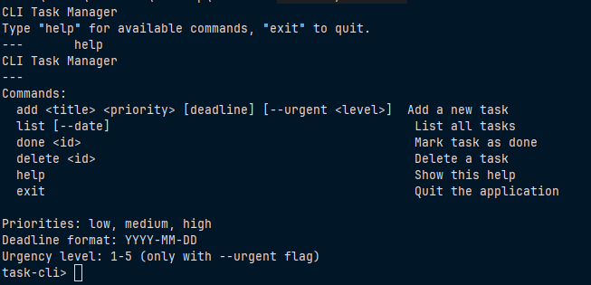

# CLI Task Manager

Un gestionnaire de tâches en cli écrit en Dart pur.



## Fonctionnalités

- Ajouter une tâche avec titre, priorité (low/medium/high) et deadline optionnelle
- Ajouter une tâche urgente avec niveau d'urgence (1-5)
- Lister les tâches triées par priorité ou par date
- Marquer une tâche comme terminée
- Supprimer une tâche
- Sauvegarde automatique dans un fichier JSON local

## Lancer l'application

```bash
dart pub get
dart run bin/main.dart
```

Le programme démarre en mode interactif. Tapez `help` pour voir les commandes disponibles et `exit` pour quitter.

## Lancer les tests

```bash
dart test
```

## Architecture

Le projet est structuré en plusieurs couches :

- **Modèles** : classe abstraite `Task`, implementations `UrgentTask` et `RegularTask`, enum `Priority`
- **Interfaces** : `TaskRepository`, `TaskService`, `TaskFormatter`
- **Services** : `TaskManagerService` contenant la logique métier
- **Persistance** : `JsonTaskRepository` pour la sauvegarde/chargement JSON
- **CLI** : `TaskCli` pour l'interaction utilisateur en ligne de commande

## Exemples de commandes

```
task-cli> add "Faire les courses" high 2026-08-31
task-cli> add "Corriger le bug" high --urgent 5
task-cli> list
task-cli> done abc123
task-cli> delete xyz789
```
